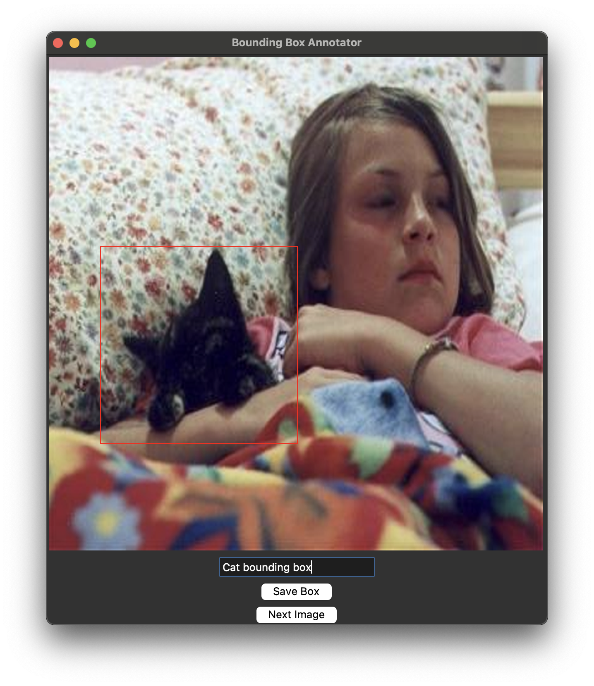
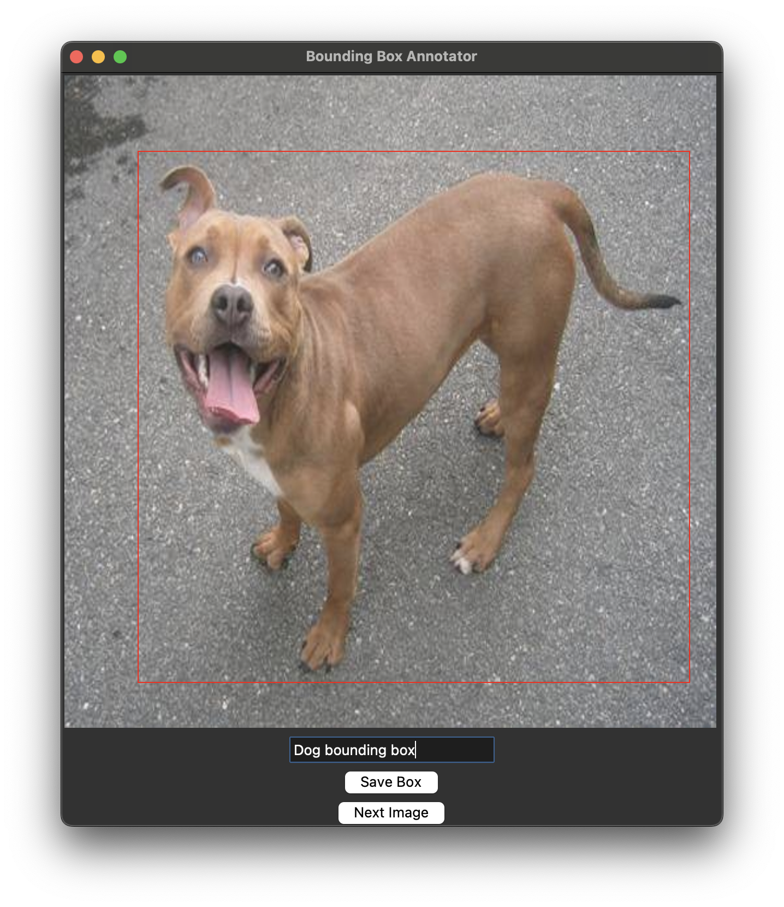

## Bounding Box Annotation Tool
This tool annotates objects in images with bounding boxes and text labels with a Tkinter-based GUI.

### Overview
- Annotates objects in images by drawing bounding boxes and assigning labels.
- Supports exporting to CSV.
- Built with Python, Tkinter, Pillow, and SQLite.

### Screenshots

### Files
- `requirements.txt`: Lists all Python dependencies required to run the tool.
- `setup_db.py`: Initializes SQLite database (`bounding_box_db.sqlite`).
- `load_images.py`: Loads images from `images/` into database.
- `annotate_boxes.py`: GUI to draw boxes and label objects.
- `export_boxes.py`: Exports annotations to `bounding_boxes.csv`.
- `bounding_box_db.sqlite`: Generated SQLite database (ignored by Git).
- `bounding_boxes.csv`: Exported annotations (ignored by Git).

### Requirements
- Python 3.7+ (tested with Python 3.13.3)
- Pillow (PIL) - for image processing
- Tkinter - for GUI (Python standard library)
- SQLite3 - for database (Python standard library)
- CSV - for data export (Python standard library)

### Setup and Usage 
#### Option 1: From GitHub (Clone)
- **Note**:
  - Start in your preferred directory (e.g., cd ~/Desktop/ or cd ~/Downloads/ or cd ~/Documents/) to control where the repository clones. 
  - If you skip this step, it clones to your current directory.
1. Clone the repository: `git clone https://github.com/mariahcoleno/annotation-classification-toolkit.git`                                      
2. Navigate to the bounding_box_annotator directory: `cd bounding_box_annotator/` (from the root of your cloned repository)
3. Create virtual environment: `python3 -m venv venv`
4. Activate virtual environment: `source venv/bin/activate`
5. Install dependencies: `pip install -r requirements.txt`
6. Prepare the shared images directory:
   - Create shared images directory if it doesn't already exist: `mkdir -p ../image_annotator/images/`
   - Ensure images are in `../image_annotator/images/` (relative to `bounding_box_annotator/`).
     - If images already exist from a prior image_annotator setup: Use those.
     - If adding new images, copy your images to the directory: `cp /path/to/your/images/*.jpg ../image_annotator/images/`
     - **Note**: This repo doesn't include sample images. You can use datasets like Kaggle's "Cats vs. Dogs" or your own images. For help, see Tips below.
7. Proceed to the "Run the Tool" section below.

#### Option 2: Local Setup (Existing Repository)
1. Navigate to your local repository: `cd ~/Documents/annotation-classification-toolkit/` # Adjust path as needed
2. Navigate to the bounding_box_annotator directory: `cd bounding_box_annotator/`
3. Setup and activate a virtual environment:
   - If existing: `source venv/bin/activate` # Adjust path if venv is elsewhere
   - If new: 
     - `python3 -m venv venv`
     - `source venv/bin/activate`
4. Install dependencies (if not already): `pip install -r requirements.txt`
5. Prepare the shared images directory:
   - Create shared images directory if it doesn't already exist: `mkdir -p ../image_annotator/images/`
   - Ensure images are in `../image_annotator/images/` (relative to `bounding_box_annotator/`).
     - If images already exist from a prior image_annotator setup: Use those.
     - If adding new images, copy your images to the directory: `cp /path/to/your/images/*.jpg ../image_annotator/images/`
     - **Note**: This repo doesn't include sample images. You can use datasets like Kaggle's "Cats vs. Dogs" or your own images. For help, see Tips below.
6. Proceed to the "Run the Tool" section below.

### Run the Tool (Both Options):
1. `python3 setup_db.py` to initialize the database.
2. `python3 load_images.py` to load images from ../image_annotator/images/.
3. `python3 annotate_boxes.py` to draw bounding boxes and label objects.
4. `python3 export_boxes.py` to export annotations to bounding_boxes.csv.

### Results
-Example Output (bounding_boxes.csv):
 file_path,x1,y1,x2,y2,label
 ../image_annotation/images/cat.6.jpg,70,222,301,459,Cat box
 ../image_annotation/images/dog.36.jpg,107,90,473,535,Dog box 

### Notes
- Shares `images/` with `image_annotator/`—ensure images are present in `../image_annotator/images/`.
- Example: Draw boxes around "cat" or "dog" and assign labels.

### Tips
- To find your image path and copy your images to images/:
  - Option 1: Use a Separate Terminal
    - Open a new terminal window or tab.
    - Navigate to your images directory: `cd ~/Downloads/` (adjust as needed).
    - Run `pwd` to get the path, e.g., `/Users/yourusername/Downloads/`
    - Copy that path. Then go back to your original terminal (still in image_annotator/), and use it in the cp command.
  - Option 2: Use your File Explorer
    - On macOS, right-click a file in Finder, hold the Option key, and select "Copy [filename] as Pathname" to get the full path.
    - On Windows or Linux, you can drag the folder into the terminal to see its path.
    - Use that path in the cp command without leaving image_annotation/.
  - Option 3: Type the Path Directly
    - If you already know where your images are (e.g.,`~/Downloads/`), just use that in the cp command.
    - You can also start typing the path in the terminal and use tab completion to fill it in.

