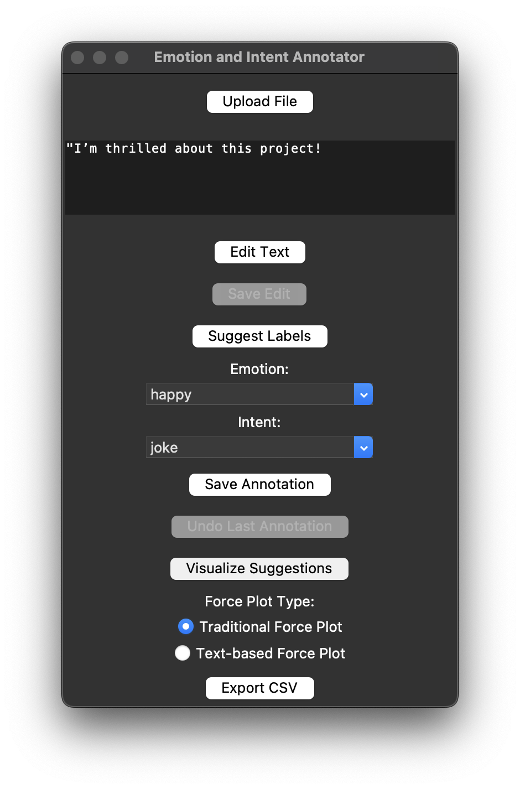
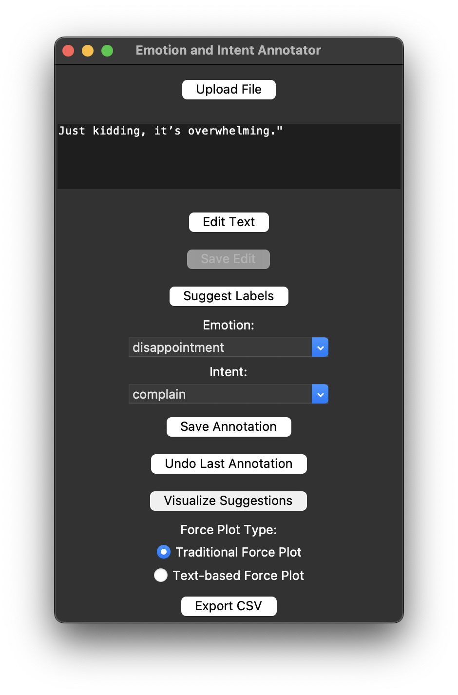
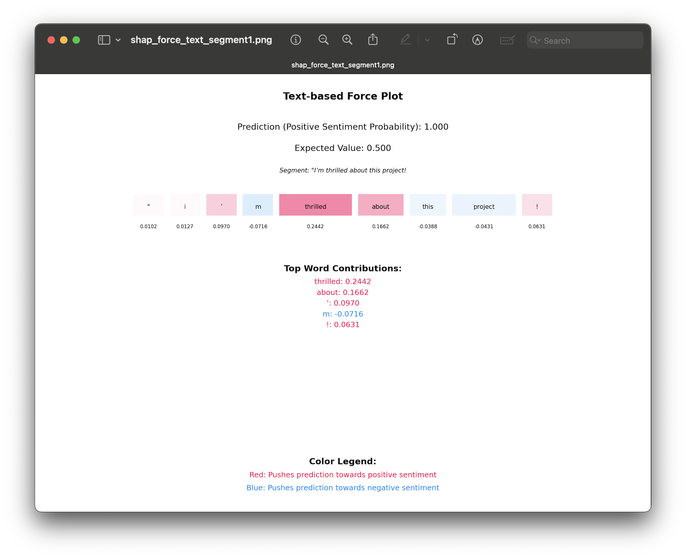
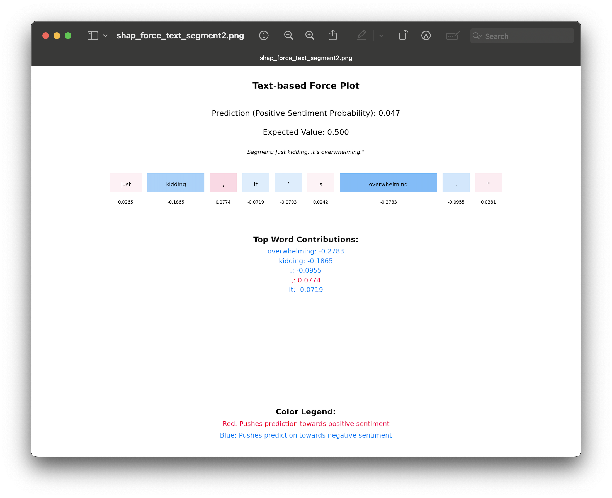
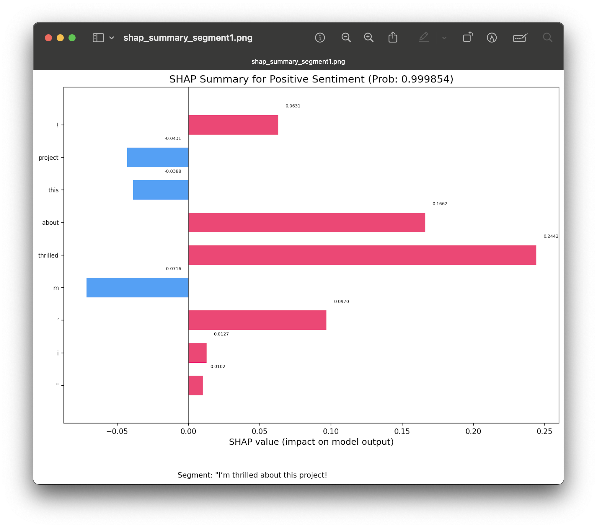
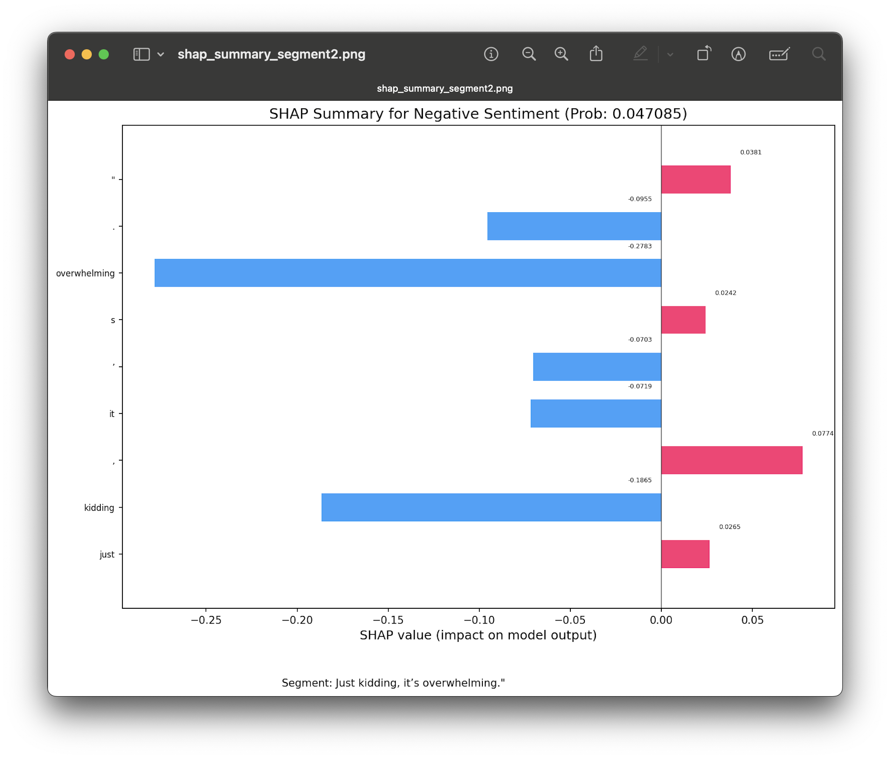
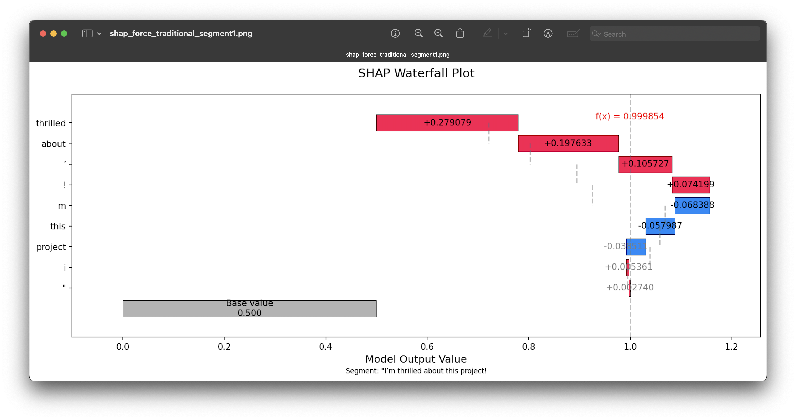
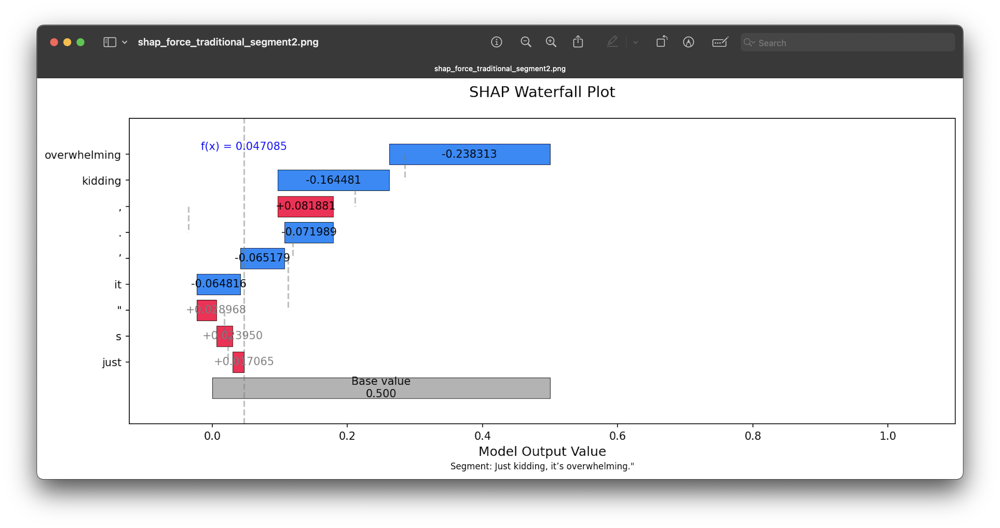

## Emotion and Intent Annotation and Classification Tool 
This tool annotates and classifies emotions and intents in text, audio, and video segments using AI suggestions with SHAP explainability in a Tkinter-based GUI.

### Features
- **Multi-format support**: Upload text (.txt) or media files (.wav, .mp3, .m4a, .mp4, .mov)
- **Audio transcription**: Convert audio/video to text using Whisper with automatic segmentation
- **AI-powered suggestions**: Context-aware emotion (happy, sad, sarcastic, angry, neutral) and intent (inform, persuade, joke, complain) predictions
- **Explainability**: SHAP visualizations show word contributions to AI suggestions
- **Interactive editing**: Edit text segments with save functionality
- **Annotation management**: Save to SQLite database, undo annotations, export to CSV
- **Smart segmentation**: Automatic text splitting at disclosure markers (e.g., "actually")

### Screenshots
#### GUI Screenshots



#### SHAP Visualizations







### Files
- `requirements.txt`: Lists all Python dependencies required to run the tool.
- `src/setup_db.py`: Initializes SQLite databse.
- `src/process_text.py`: Text segmentation and AI suggestions.
- `src/annotate_emotions.py`: The main script that runs a Tkinter-based GUI to display texts from `emotions_intents.sqlite` and save annotations (emotions/intents) to the database.
- `src/audio.py`: Handles audio transcriptions using openai-whisper and segments transcriptions for annotation. 
- `data/sample_text.txt`: File that contains sample texts.
- `data/sample_audio.m4a`: File that contains sample audio.
- `data/sample_audio.wav`: File that contains sample audio.
- `data/sample_video.mp4`: File that contains sample video.
- `emotions_intents.sqlite`: Generated SQLite database storing labeled texts (ignored by Git).
- `annotations_export.csv`: Exported CSV of labeled texts (ignored by Git).

### Requirements
- Python 3.8+ (tested with Python 3.13.3)
- pandas - for data manipulation and CSV handling
- torch - for PyTorch machine learning models
- transformers - for Hugging Face NLP models and pipelines (for emotion suggestions)
- textblob - for natural language processing
- shap - for model explainability
- matplotlib - for plotting and visualizations
- numpy - for numerical operations
- openai-whisper - for speech-to-text transcription
- nltk - for natural language toolkit (sentence segmentation)
- librosa - for advanced audio analysis and feature extraction from audio files
- opencv-python-headless - for video processing and frame extraction (headless version without GUI dependencies)
- pydub - for audio file format conversion and basic audio manipulationpydub

### Setup and Usage
#### Option 1: From GitHub (First Time Setup)
- **Note**:
  - Start in your preferred directory (e.g., cd ~/Desktop/ or cd ~/Downloads/ or cd ~/Documents/) to control where the repository clones. 
  - If you skip this step, it clones to your current directory.
1. Clone the repository: `git clone https://github.com/mariahcoleno/annotation-classification-toolkit.git`
2. Navigate to the emotion_intent_annotator directory: `cd emotion_intent_annotator/` (from the root of your cloned repository)
3. Create virtual environment: `python3 -m venv venv`
4. Activate: `source venv/bin/activate` # On Windows: venv\Scripts\activate
5. Install dependencies: `pip install -r requirements.txt`
6. Install ffmpeg (required for audio/video processing):
   - macOS: `brew install ffmpeg`
   - Ubuntu/Debian: `sudo apt-get install ffmpeg` 
   - Windows: Download from https://ffmpeg.org/download.html and add to PATH
7. Set environment variable (optional, suppresses warnings): `export TOKENIZERS_PARALLELISM=false`  
8. Proceed to the "Run the Tool" section below.

#### Option 2: Local Setup (Existing Repository)
1. Navigate to your local repository `cd ~/Documents/annotation-classification-toolkit/` # Adjust path as needed
2. Navigate to emotion_intent_annoator directory: `cd emotion_intent_annotator/`
3. Setup and activate a virtual environmnt:
   - If existing: `source venv/bin/activate` # Adjust path if venv is elsewhere
   - If new:
     - `python3 -m venv venv`
     - `source venv/bin/activate` # On Windows: venv\Scripts\activate
4. Install dependencies (if not already): `pip install -r requirements.txt` 
5. Install ffmpeg (required for audio/video processing):
   - macOS: `brew install ffmpeg`
   - Ubuntu/Debian: `sudo apt-get install ffmpeg`
   - Windows: Download from https://ffmpeg.org/download.html and add to PATH          
6. Set environment variable (optional, suppresses warnings): `export TOKENIZERS_PARALLELISM=false`
7. Proceed to the "Run the Tool" section below.

### Run the Tool (Both Options):
1. Initialize the database: `python3 src/setup_db.py`
2. Start the application: `python3 -m src.annotate_emotions` 
3. Using the GUI:
   - **Upload**: Click "Upload File" and selecct a text file (.txt) or media file (`.wav`, `.mp3`, `.m4a`, `.mp4`, `.mov`)
   - **Review segments**: View auot-segmented text/transcriptions; edit if needed using "Edit Segment"
   - **Get AI suggestions**: Click "Suggest Labels" for emotion/intent predictions
   - **View explanations**: Click "Visualize Suggestions" to see SHAP plots
   - **Annotate**: Select emotions and intents, then click "Save Annotation"
   - **Export**: Click "Export CSV" to save annotations as annotations_export.csv
   - **Undo**: Use "Undo Last Annotation" to revert changes

Note: NLTK punkt tokenizer downloads automatically on first run.
    
### Advanced Usage
Reset database (clears all data):
 - `mv emotions_intents.sqlite emotions_intents_backup_$(date +%F).sqlite`
 - `python3 src/setup_db.py`
    
### Sample Data
The repository includes an example text file for testing text segmentation and annotation:
- **`data/sample_text.txt`**: 
  ```text
  I’m thrilled about this project! Just kidding, it’s overwhelming.
  ```
  This file is used to demonstrate the GUI’s ability to segment text into sentences and annotate emotions and intents. You can also upload your own .txt files via the GUI.

### Project Structure
- annotation-classification-toolkit/
  - emotion_intent_annotator/
    - data/
      - sample_audio.m4a # Example audio file
      - sample_audio.wav # Example audio file
      - sample_text.txt # Example text file
      - sample_video.mp4 # Example video file 
    - screenshots/ (multiple image files)
    - src/
      - __init__.py
      - annotate_emotions.py # GUI for annotation
      - audio.py # Audio transcription and segmentation
      - process_text.py # Text segmentation and AI suggestions 
      - setup_db.py # Initializes SQLite database
    - .gitignore
    - README.md
    - requirements.txt
  - .gitignore
  - README.md

### Development Notes
- Application developed through iterative prompt engineering with AI tools (Claude/Grok) for rapid prototyping and learning.
- SHAP implementation for emotion/intent explanation developed through iterative troubleshooting and refinement.

