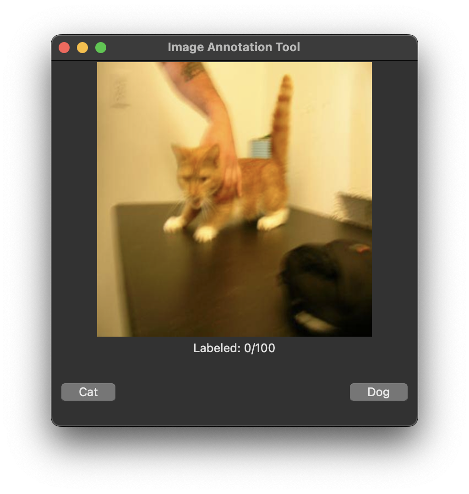
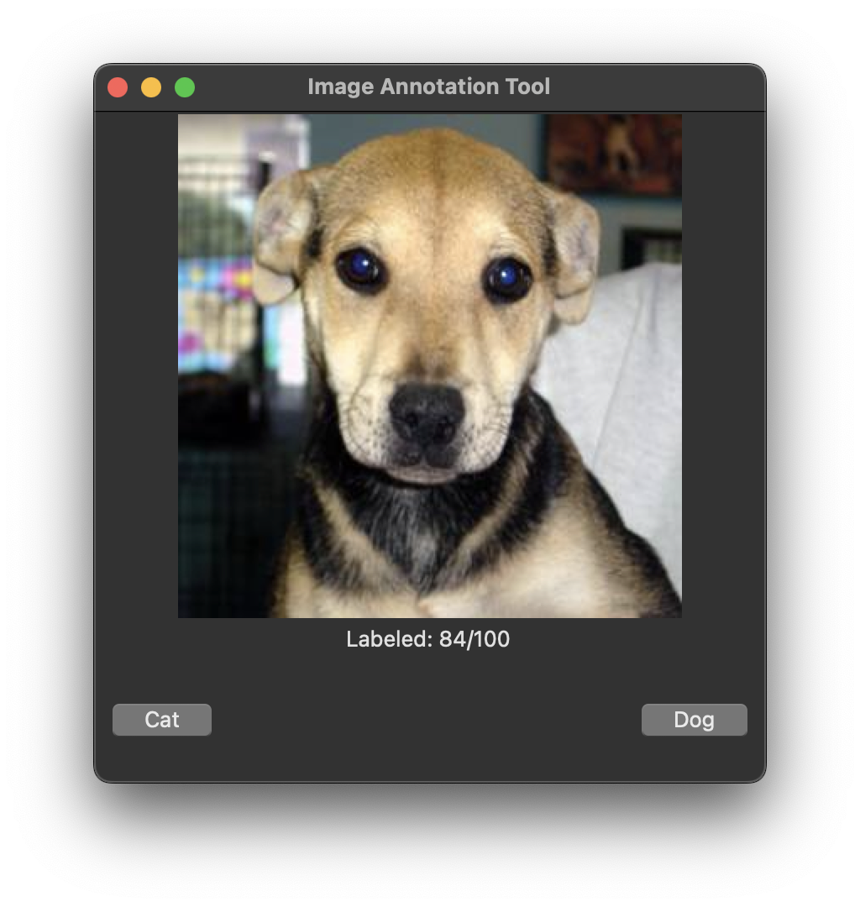

# ImageAnnotationToolV2
## Image Annotation Tool
A Python-based workflow for labeling images and training a PyTorch CNN to classify cats and dogs.

### Overview
- Labels 100 images (50 cats, 50 dogs) using a Tkinter GUI with 300x300 resizing.
- Trains a CNN on 64x64 images, reporting training, validation, and test accuracies.
- Built with Python, Tkinter, Pillow, SQLite (with PRAGMA foreign_keys, ON DELETE CASCADE), PyTorch, and Scikit-learn.

### Screenshots

### Files
- `requirements.txt`: Lists dependencies (e.g., Pillow, torch, numpy, etc.) required to run the scripts.
- `setup_db.py`: Initializes SQLite database (`annotation_db.sqlite`).
- `load_images.py`: Loads images into database.
- `label_images.py`: Main script for labeling images.
- `view_labeled.py`: Script to view labeled images.
- `images/`: Directory for input images (e.g., example.jpg) (ignored by Git)
- `check_images.py`: Verifies labels.
- `export_labels.py`: Exports labels to CSV (`labeled_images.csv`).
- `verify_images.py`: Validates data integrity.
- `train_cnn_pytorch.py`: Trains PyTorch CNN on labeled data.
- `cat_dog_cnn_pytorch.pth`: Trained model weights (800KB).
- `annotation_db.sqlite`: Generated SQLite database storing annotations (ignored by Git)
- `labeled_images.csv`: Exported labeled image data (ignored by Git)

### Setup and Usage
#### Option 1: From GitHub (Clone)
- **Note**: 
  - Start in your preferred directory (e.g., `cd ~/Desktop/` or `cd ~/Downloads/` or `cd ~/Documents/`) to control where the repository clones. 
  - If you skip this step, it clones to your current directory.
1. Clone the repository: `git clone https://github.com/mariahcoleno/ImageAnnotationToolV2.git`
2. Navigate to the image_annotation directory: `cd image_annotation/` (from the root of your cloned repository)
3. Create a virtual environment: `python3 -m venv venv`
4. Activate the virtual environment: `source venv/bin/activate`
5. Install dependencies: `pip install -r requirements.txt`
6. Prepare the images/ directory:
   - Create images/ directory: `mkdir -p images/`
   - Place images (e.g., from ~/Downloads/', ~/Pictures/, or a dataset like Kaggle's "Cats vs. Dogs") in the `images/ directory (ignored by Git): `cp /path/to/your/images/*.jpg images/`
   - **Note**: 
     - This repo does not include sample images.
     - To find your image path and copy your images to images/:
       - Option 1: Use a Separate Terminal
         - Open a new terminal window or tab.
         - Navigate to your images directory: cd ~/Downloads/ (adjust as needed).
         - Run pwd to get the path, e.g., /Users/yourusername/Downloads/.
         - Copy that path. Then go back to your original terminal (still in image_annotation/), and use it in the cp command.
       - Option 2: Use your File Explorer
         - On macOS, right-click a file in Finder, hold the Option key, and select "Copy [filename] as Pathname" to get the full path (e.g., /Users/yourusername/Downloads/image1.jpg). Remove the filename to get the directory path.
         - On Windows or Linux, you can drag the folder into the terminal to see its path.
         - Use that path in the cp command without leaving image_annotation/.
       - Option 3: Type the Path Directly
         - If you already know where your images are (e.g., ~/Downloads/), just use that in the cp command.
         - You can also start typing the path in the terminal and use tab completion to fill it in.
7. Proceed to the "Run the Tool" section below. 

#### Option 2: Local Setup (Existing Repository)
1. Navigate to your local repository: `cd ~/Documents/AnnotationProject/` # Adjust path as needed
2. Navigate to the image_annotation directory: `cd image_annotation/`
3. Setup and activate a virtual environment:
   - If existing: `source venv/bin/activate` # Adjust path if venv is elsewhere
   - If new:
     - `python3 -m venv venv`
     - `source venv/bin/activate`
4. Install dependencies (if not already): `pip install -r requirements.txt`
5. Prepare the images/ directory:
   - Create images/ directory: `mkdir -p images/`
   - Place images (e.g., from ~/Downloads/', ~/Pictures/, or a dataset like Kaggle's "Cats vs. Dogs") in the `images/ directory (ignored by Git): `cp /path/to/your/im$
   - **Note**:
     - This repo does not include sample images.
     - To find your image path and copy your images to images/:
       - See "Option 1: From GitHub (Clone)", step 6 for a list of available options.
6. Proceed to the "Run the Tool" section below. 

### Run the Tool (Both Options):
1. `python3 setup_db.py` to initialize the database.
2. `python3 load_images.py` to load images.
3. `python3 label_images.py` to label images.
4. `python3 view_labeled.py` to view labeled images.
5. `python3 export_labels.py` to export annotations to labeled_images.csv
6. `python3 train_cnn_pytorch.py` to train the CNN (after labeling).

### Results
- Annotation: 100% user accuracy after 5+ hours of debugging.
- CNN (10 epochs):
  - Training Accuracy: ~100% (80 images).
  - Validation Accuracy: ~100% (10 images).
  - Test Accuracy: 70% (10 images, small dataset).

### Note
- PyTorch CNN code adapted from xAI's Grok as I learn PyTorch.
- Results based on 100 labeled images; expect variance with small test set (10 images).
