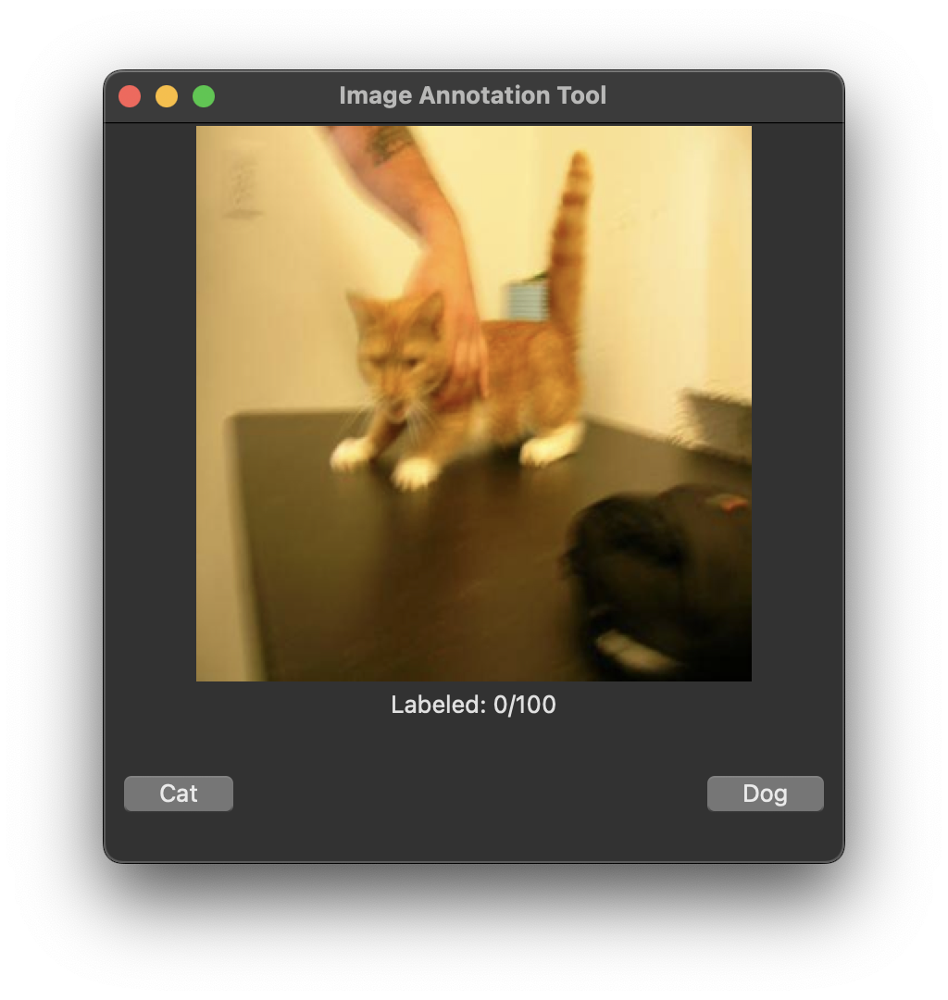
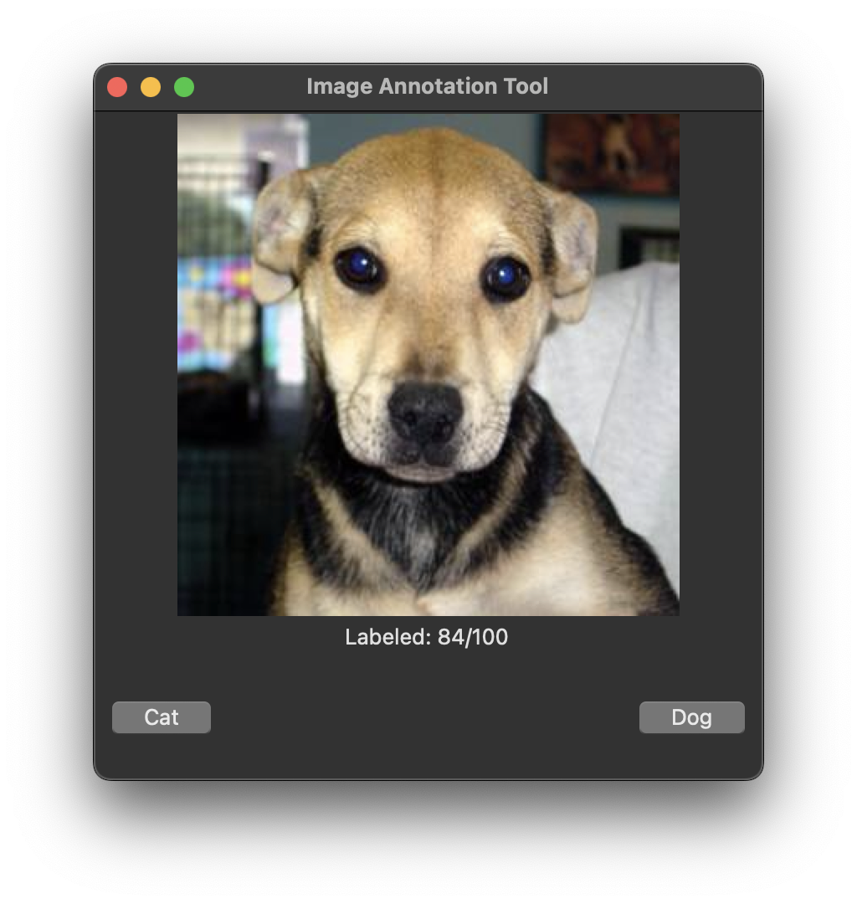

## Image Annotation and Classification Tool
This tool annotates and classifies images (e.g., cats/dogs) using a Tkinter-based GUI.

### Features
- Label 100 images (50 cats, 50 dogs) with 300X300 resizing using a Tkinter-based GUI.
- Train a CNN on 64x64 images, reporting training, validation, and test accuracies.

### Screenshots

### Files
- `requirements.txt`: Lists all Python dependencies required to run the tool.
- `setup_db.py`: Initializes SQLite database (`annotation_db.sqlite`).
- `load_images.py`: Loads images into database.
- `label_images.py`: Main script for labeling images.
- `view_labeled.py`: Script to view labeled images.
- `images/`: Directory for input images (e.g., example.jpg) (ignored by Git)
- `check_images.py`: Verifies labels.
- `export_labels.py`: Exports labels to CSV (`labeled_images.csv`).
- `verify_images.py`: Validates data integrity.
- `train_cnn_pytorch.py`: Trains CNN on labeled data.
- `cat_dog_cnn_pytorch.pth`: Trained model weights (800KB).
- `annotation_db.sqlite`: Generated SQLite database storing annotations (ignored by Git)
- `labeled_images.csv`: Exported labeled image data (ignored by Git)

### Requirements
- Python 3.7+ (tested with Python 3.13.3)
- PyTorch - for neural network training
- Torchvision - for image models and transforms
- NumPy - for array operations
- Scikit-learn - for train/test splitting
- Pillow (PIL) - for image processing

### File Format Requirements
- Supported image formats: `.jpg`, `.png`, `.gif`

### Setup and Usage
#### Option 1: From GitHub (First Time Setup)
- **Note**: 
  - Start in your preferred directory (e.g., `cd ~/Desktop/` or `cd ~/Downloads/` or `cd ~/Documents/`) to control where the repository clones. 
  - If you skip this step, it clones to your current directory.
1. Clone the repository: `git clone https://github.com/mariahcoleno/annotation-classification-toolkit.git`
2. Navigate to the image_annotator directory: `cd image_annotator/` (from the root of your cloned repository)
3. Create a virtual environment: `python3 -m venv venv`
4. Activate the virtual environment: `source venv/bin/activate`
5. Install dependencies: `pip install -r requirements.txt`
6. Prepare the images/ directory:
   - Create images/ directory: `mkdir -p images/`
   - Copy your images to the directory: `cp /path/to/your/images/* images/`
   - **Note**: This repo doesn't include sample images. You can use datasets like Kaggle's "Cats vs. Dogs" or your own images. For help, see Tips below.
7. Proceed to the "Run the Tool" section below.

#### Option 2: Local Setup (Existing Repository)
1. Navigate to your local repository: `cd ~/Documents/annotation-classification-toolkit/` # Adjust path as needed
2. Navigate to the image_annotator directory: `cd image_annotator/`
3. Setup and activate a virtual environment:
   - If existing: `source venv/bin/activate` # Adjust path if venv is elsewhere
   - If new:
     - `python3 -m venv venv`
     - `source venv/bin/activate`
4. Install dependencies (if not already): `pip install -r requirements.txt`
5. Prepare the images/ directory:
   - Create images/ directory: `mkdir -p images/`
   - Copy your images to the directory: `cp /path/to/your/images/* images/`
   - **Note**: This repo doesn't include sample images. You can use datasets like Kaggle's "Cats vs. Dogs" or your own images. For help, see Tips below.
6. Proceed to the "Run the Tool" section below. 

### Run the Tool (Both Options):
1. Initialize the Database: `python3 setup_db.py` 
2. Load images: `python3 load_images.py` 
3. Label images: `python3 label_images.py` 
4. View labeled images: `python3 view_labeled.py` 
5. Export annotations to labeled_images.csv: `python3 export_labels.py`
6. Train CNN: `python3 train_cnn_pytorch.py` 

### Results
- **Manual Annotation**: 100% accuracy (100 images labeled)
- **CNN Training (10 epochs)**:
  - Training Accuracy: ~100% (80 images)
  - Validation Accuracy: ~100% (10 images)
  - Test Accuracy: 70% (10 images)
  - **Note**: Test accuracy of 70% is expected given the small dataset size (10 test images). Results will improve with larger datasets.

### Project Structure
- annotation-classification-toolkit/
  - image_annotator/
    - images (contains 100 sample images for training)
    - screenshots
      - gui_dog_image.png
      - gui_image_loaded.png
    - README.md
    - cat_dog_cnn_pytorch.pth
    - check_images.py
    - export_labels.py
    - label_images.py
    - load_images.py
    - requirements.txt
    - setup_db.py
    - train_cnn_pytorch.py
    - verify_images.py
    - view_labeled.py

### Tips
- To find your image path and copy your images to images/:
  - Option 1: Use a Separate Terminal
    - Open a new terminal window or tab.   
    - Navigate to your images directory: `cd ~/Downloads/` (adjust as needed).
    - Run `pwd` to get the path, e.g., `/Users/yourusername/Downloads/`
    - Copy that path. Then go back to your original terminal (still in image_annotator/), and use it in the cp command.
  - Option 2: Use your File Explorer
    - On macOS, right-click a file in Finder, hold the Option key, and select "Copy [filename] as Pathname" to get the full path.
    - On Windows or Linux, you can drag the folder into the terminal to see its path.
    - Use that path in the cp command without leaving image_annotation/.
  - Option 3: Type the Path Directly
    - If you already know where your images are (e.g.,`~/Downloads/`), just use that in the cp command.
    - You can also start typing the path in the terminal and use tab completion to fill it in.  

### Development Notes
- Application developed through iterative prompt engineering with AI tools (Claude/Grok) for rapid prototyping and learning.
- CNN architecture specifically adapted from xAI's Grok as part of PyTorch learning process.
