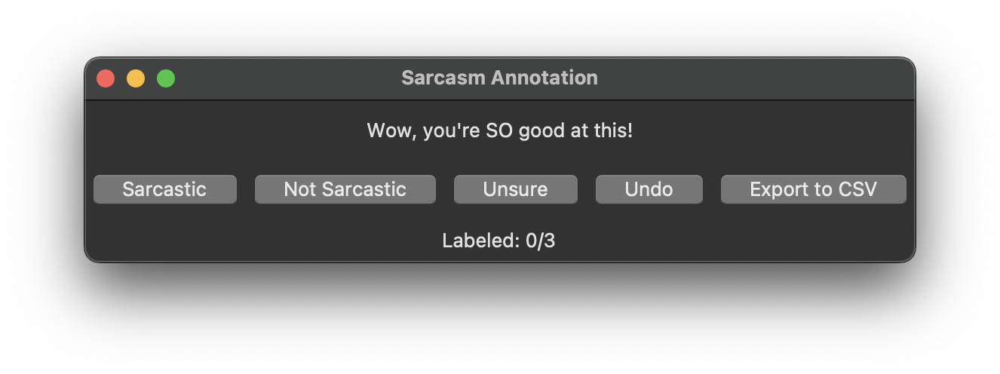

### Sarcasm Annotation and Classification Tool
This tool annotates and classifies text for sarcasm using a Tkinter-based GUI.

### Overview
- Labels text as sarcastic, not sarcastic, or unsure using a Tkinter-based GUI.
- Supports undoing annotations and exporting to CSV.
- Trains a Scikit-learn logistic regression classifier with TF-IDF vectorization on labeled texts, reporting training, validation, and test accuracies.
- Built with Python, Tkinter, SQLite (with PRAGMA foreign_keys, ON DELETE CASCADE), and Scikit-learn. 

### Screenshots

### Files
- `requirements.txt`: Lists all Python dependencies required to run the tool.
- `setup_sarcasm_db.py`: Initializes `sarcasm_db.sqlite` with `texts` and `sarcasm_annotations` tables, setting up the database structure.
- `load_texts.py`: Loads 20 sarcasm texts to the `sarcasm_db.sqlite` database.
- `migrate_labels.py`: A one-time migration script used to add 3 hardcoded messages to the `sarcasm_db.sqlite` database, increasing the text count to 23.  
- `sample_texts.txt`: File that contains sample sarcasm texts.
- `annotate_sarcasm.py`: The main script that runs a Tkinter-based GUI to display texts from `sarcasm_db.sqlite` and save annotations (sarcastic/not sarcastic/unsure) to the database.
- `sarcasm_db.sqlite`: Generated SQLite database storing annotations (ignored by Git).
- `sarcasm_labels.csv`: Exported CSV of labeled texts (ignored by Git).
- `train_sarcasm_classifier.py`: Trains a Scikit-learn logistic regression classifier with TF-IDF vectorization on labeled texts, reporting training, validation, and test accuracies.  Saves the trained model as `sarcasm_classifier.pkl`.
- `sarcasm_classifier.pkl`: Trained logistic regression model (generated after running training, ignored by Git).

### Requirements
- Python 3.7+ (tested with Python 3.13.3)
- Scikit-learn - for logistic regression and TF-IDF text vectorization
- NumPy - for array operations  
- Joblib - for model serialization
- Tkinter - for GUI (usually included with Python)
- SQLite3 - for database (usually included with Python)

### Model Details
- **Algorithm**: Logistic Regression with TF-IDF vectorization
- **Features**: Up to 5,000 TF-IDF features, English stop words removed
- **Data Split**: 70% training, 15% validation, 15% testing
- **Classification**: Binary classification (Sarcastic (1) vs Not Sarcastic (0))
- **Note**: "Unsure" labels are excluded from training data

### Setup and Usage
#### Option 1: From GitHub (Clone)
- **Note**:
  - Start in your preferred directory (e.g., cd ~/Desktop/ or cd ~/Downloads/ or cd ~/Documents/) to control where the repository clones. 
  - If you skip this step, it clones to your current directory.
1. Clone the repository: `git clone https://github.com/mariahcoleno/annotation-classification-toolkit.git`
2. Navigate to the sarcasm_annotator directory: `cd sarcasm_annotator/` (from the root of your cloned repository)
3. Create virtual env: `python3 -m venv venv`
4. Activate: `source venv/bin/activate`
5. Install dependencies: `pip install -r requirements.txt`
6. Proceed to the "Run the Tool" section below.

#### Option 2: Local Setup (Existing Repository):
1. Navigate to your local repository `cd ~/Documents/annotation-classification-toolkit/` # Adjust path as needed
2. Navigate to sarcasm_annotator directory: `cd sarcasm_annotator/`
3. Setup and activate a virtual environment:
   - If existing: `source venv/bin/activate` # Adjust path if venv is elsewhere
   - If new:
     - `python3 -m venv venv`
     - `source venv/bin/activate`
4. Install dependencies (if not already): `pip install -r requirements.txt` 
5. Proceed to the "Run the Tool" section below.

### Run the Tool (Both Options):
1. `python3 setup_sarcasm_db.py` to create empty tables in the `sarcasm_db.sqlite` database.
2. `python3 load_texts.py` to automatically load 20 texts from `sample_texts.txt` (included) into the `sarcasm_db.sqlite` database.
3. `python3 migrate_labels.py` to add 3 hardcoded texts to the `sarcasm_db.sqlite` database.
4. `python3 annotate_sarcasm.py` to:
   - Open a GUI with the 23 sample texts.
   - Use "Sarcastic", "Not Sarcastic", or "Unsure" buttons to label each text. 
   - Store annotations in a SQL database and export to CSV.
   - Click "Undo" to revert the last annotation.
5. `python3 train_sarcasm_classifier.py` to train a Scikit-learn logistic regression classifier on labeled texts, reporting training, validation, and test accuracies.

### Features
- **Export to CSV Button**: Saves all current annotations to `sarcasm_labels.csv` at any time.
- **Undo Button**: Reverts the last annotation, updating the database and GUI.
- **Progress Tracking**: Displays "Labeled: X/Y" (e.g., "Labeled: 2/23").
- **Predefined Texts**:  No external `texts.txt` required.

### Notes
- The database (`sarcasm_db.sqlite`), once populated, contains 23 texts, including 3 migrated hardcoded messages.
- The 3 hardcoded messages ("Wow, you're SO good at this!", "I love Mondays.", "Nice weather today.") were migrated once using `migrate_labels.py` and are now part of the main database.
- The tool is designed for manual annotation to support sarcasm detection models.
- "Unsure" labels in the GUI are stored, supporting flexible annotation workflows.
- Automatic loading from sample_texts.txt simplifies the user experience.
